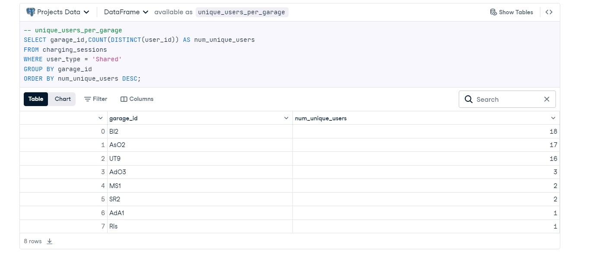

# Analyzing-EV-Charging-Habits-in-Apartment-Buildings-using-SQL

## Introduction
As the popularity of electric vehicles (EVs) continues to rise, the demand for accessible charging stations in residential buildings is becoming increasingly critical. This project aims to analyze charging habits within apartment complexes, focusing on the usage of shared versus private charging stations. The findings will provide insights to building managers, enabling them to optimize charging station availability and improve the overall tenant experience.

## Dataset Overview
The analysis utilizes a dataset contained in a PostgreSQL database, specifically the charging_sessions table. The relevant columns in the dataset include:

- _garage_id_: Identifier for the garage/building
- _user_id_: Identifier for the individual user
- _user_type_: Indicates whether the station is Shared or Private
- _start_plugin_: Date and time the charging session started
- _start_plugin_hour_: Hour the session started (military time)
- _end_plugout_: Date and time the charging session ended
- _end_plugout_hour_: Hour the session ended (military time)
- _duration_hours_: Length of the session in hours
- _el_kwh_: Amount of electricity used (in kilowatt-hours)
- _month_plugin_: Month that the session started
- _weekdays_plugin_: Day of the week that the session started

## Methodology
**Unique Users Per Garage:** To identify how many distinct users utilize the charging stations in each garage, we executed a query that counted unique user_id entries for each garage_id. This helps ascertain which garages have the highest user engagement.

**Most Popular Shared Charging Start Times:** We analyzed the start times of charging sessions by grouping them based on the day of the week and the hour they began. This allows for understanding peak usage times for shared charging stations.

**Long Duration Shared Users**: To identify users who frequently utilize charging stations for extended periods, we calculated the average duration of sessions for each user, focusing specifically on those who averaged over 10 hours. This identifies users who may require more dedicated charging solutions.

## Findings
### Unique Users Per Garage:
The analysis revealed that Garage Bl2 had the highest number of unique users, totaling 18 distinct individuals, followed by Garage AsO2 with 17 unique users.

### Most Popular Shared Charging Start Times:
Charging sessions were most frequently initiated on Sundays, particularly at 17:00 (5 PM), with a total of 30 sessions recorded.

### Long Duration Shared Users:
The user Share-9 had a high average charging duration of approximately 16.85 hours, indicating significant reliance on shared charging facilities.

## Conclusion
The analysis highlights the growing need for efficient management of shared charging stations in apartment complexes as EV adoption increases. Understanding user behavior, especially the distribution of unique users across garages and the timing of charging sessions, will help building managers improve the accessibility and availability of charging ports. Future recommendations include evaluating the potential for expanding charging infrastructure in high-demand areas and optimizing the scheduling of shared stations to alleviate competition for charging resources.

## Project Notebook
You can view the complete project notebook on DataCamp Datalab by [Clicking here](https://www.datacamp.com/datalab/w/55d5ebdb-c83a-4aed-887a-48ef05db65f5/edit)
